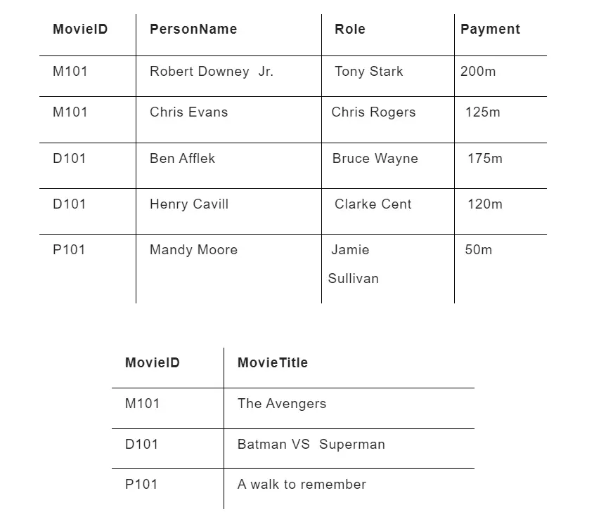

Here's a more user-friendly version of the README content, with enhanced formatting for clarity and readability:

---

# DBMS

### Q1. What is DBMS used for? (TCS)
A Database Management System (DBMS) is an application system designed for managing data. It enables users to:
- Store data
- Define data
- Retrieve data
- Update data

### Q2. Why is the use of DBMS recommended? Explain by listing some of its major advantages. (WIPRo)
DBMS offers several advantages:
- **Controlled Redundancy**: Reduces data duplication.
- **Data Sharing**: Facilitates data access by multiple users.
- **Backup and Recovery Facility**: Ensures data protection and restoration.
- **Enforcement of Integrity Constraints**: Maintains data accuracy and consistency.
- **Independence of Data**: Separates data from application programs.

### Q3. What is Schema? (Amazon)
A **Schema** represents the structure of a database, typically through a diagram. It shows the relationships between tables but does not display the actual data in those tables.

### Q4. What is Instance? (Adobe)
An **Instance** of a database refers to the data present in the database at a specific moment. The database schema defines the structure, while the instance represents the actual data values at a given time.

### Q5. Explain the three layers of the 3-tier architecture.
The three layers are:
1. **Client Layer**: The user interface.
2. **Business Layer**: The application logic.
3. **Data Layer**: The database.

---

# ER MODEL

### What are ER Models?
An **Entity Relationship Diagram (ERD)** visually represents different data elements and their relationships. The E-R modeling technique is a top-down approach.

For example, the elements "writer," "novel," and "consumer" can be depicted using ER diagrams:

In the diagram:
- Entities are represented by rectangles.
- Relationships are depicted by diamonds.

### ER Diagram
ER-modeling is a technique used to create a conceptual data model of an information system. The diagrams produced are known as Entity-Relationship Diagrams (ERDs).

### Entity
An **Entity** is a distinguishable object with attributes. In a database, entities represent real-world objects or concepts.

**Example**: In a school database, entities might include students, teachers, classes, and courses.

### Types of Entity

1. **Strong Entities**: Exist independently of other entities.
   

2. **Weak Entities**: Depend on other entities for identification.
   

3. **Recursive Entities**: An entity where a relation exists between occurrences of the same entity set. For example, an employee who is also a manager.
   

4. **Composite Entities**: Used to resolve many-to-many relationships by creating a bridge entity. Represented by a diamond shape within a rectangle.
   

### Entity Sets
An **Entity Set** is a collection of similar entities. It can contain entities with attributes that share similar values. Entity sets do not need to be disjoint.

**Example**: A "Students" set may include all students in a school.

### Weak Entity
A **Weak Entity** relies on another entity for its identification. It uses a foreign key combined with its attributes to form a primary key.

**Example**: An order item depends on an order for its meaning.

### Attribute
**Attributes** represent the properties of entities. They have specific values and fall within a defined domain.

**Example**: A student entity might have attributes such as name, class, and age.

### Types of Attributes

1. **Simple Attributes**: Atomic values that cannot be divided further.
   

2. **Composite Attributes**: Attributes that can be divided into smaller sub-attributes. Represented by a tree-like structure.
   

3. **Derived Attributes**: Attributes whose values are derived from other attributes. They do not exist directly in the database.
   

4. **Multi-valued Attributes**: Attributes that can hold multiple values.
   

# Relationships

### One-to-One
In a one-to-one relationship, an entity from **Entity Set A** can be associated with at most one entity from **Entity Set B**, and vice versa.

### One-to-Many
In a one-to-many relationship, an entity from **Entity Set A** can be associated with multiple entities from **Entity Set B**. However, an entity from **Entity Set B** can be associated with at most one entity from **Entity Set A**.

### Many-to-One
In a many-to-one relationship, multiple entities from **Entity Set A** can be associated with at most one entity from **Entity Set B**. Conversely, an entity from **Entity Set B** can be associated with multiple entities from **Entity Set A**.

### Many-to-Many
In a many-to-many relationship, an entity from **Entity Set A** can be associated with multiple entities from **Entity Set B** and vice versa.
- A many to many relationships between two entities usually results in Three tables.

### Total and Partial Participation

- **Total Participation**: Each entity in the entity set must participate in at least one relationship within that relationship set. This is indicated by double lines drawn from the entity to the relationship.

- **Partial Participation**: Not all entities in the entity set need to participate in the relationship. This is shown by single lines drawn from the entity to the relationship.

# Creating an ER Diagram

### Entities
An **Entity** is an object or concept about which you want to store information.

- **Weak Entity**: A weak entity cannot be uniquely identified by its own attributes alone and must be defined by a foreign key relationship with another entity.

### Relationships
**Relationships** are represented by diamond shapes and show how two entities share information in the database.

### Attributes
**Attributes** are represented by ovals. A **key attribute** is a unique, distinguishing characteristic of the entity.

**Example**: An employee's social security number might be the key attribute for the employee.

- **Multivalued Attribute**: An attribute that can have more than one value.

**Example**: An employee entity can have multiple skill values.

### Generalization
**Generalization** is the process of combining multiple entities into one generalized entity based on shared characteristics.

**Example**: Pigeons, house sparrows, crows, and doves can all be generalized as "Birds."

### Specialization
**Specialization** is the opposite of generalization. It involves dividing a group of entities into subgroups based on specific characteristics.

**Example**: A person can be specialized into roles such as employee, employer, customer, or vendor, based on their role in a company. Similarly, in a school database, persons can be specialized into roles such as teacher, student, or staff.

### Aggregation
**Aggregation** refers to the process of combining entities to form a single meaningful entity. It represents a relationship between a whole object and its component parts. Aggregation is used to model relationships among relationships.

### Problems

1. **Hospital ER Diagram**: Construct an ER diagram for a hospital with a set of patients and a set of doctors. Associate each patient with a log of various tests and examinations conducted.

   

2. **Car Insurance Company ER Diagram**: Construct an ER diagram for a car-insurance company where customers own one or more cars. Each car may have zero or more recorded accidents.

   

Here's a polished version of the README for your interview questions:

---

# Interview Questions and Answers

### Q1. What is Cardinality? (Capgemini)

Cardinality refers to the nature of the relationships between entities in a database. It defines the number of instances of one entity that can or must be associated with instances of another entity. The primary types of cardinality are:

- **One-to-One:** A single record in one entity is related to a single record in another entity.
- **One-to-Many:** A single record in one entity can be related to multiple records in another entity.
- **Many-to-Many:** Multiple records in one entity can be related to multiple records in another entity.

In database terminology, **high cardinality** indicates a column with a large number of unique values, while **low cardinality** means fewer unique values.

---

### Q2. What Does ERD Stand For, and What Is It? (TCS)

**ERD** stands for **Entity Relationship Diagram**. It is a visual representation of entities and their relationships in a database. In an ERD:

- **Entities** are represented by rectangles or boxes.
- **Relationships** between entities are illustrated by lines or arrows connecting these boxes.

ERDs help in designing and understanding the structure of a database.

---

### Q3. What is an Entity? (Wipro)

An **entity** in a database context is a distinct object or concept that can be identified and stored. It represents a real-world object, person, place, or event. For detailed definitions of entities in specific operating systems, please refer to the notes under the heading "Entity."

---

### Q4. Explain a Real-Life Example of Generalization. (Amazon)

**Generalization** involves creating a higher-level entity from multiple lower-level entities. For instance:

- **Saving Account** and **Current Account** are specific types of accounts.
- They can be generalized into a single higher-level entity called **Account**, which encompasses both types.

---

### Q5. How Does Generalization Differ from Specialization? (TCS, Infosys)

- **Generalization** is a bottom-up approach where multiple lower-level entities are combined to form a higher-level entity. 
  - Example: Combining **Saving Account** and **Current Account** into **Account**.

- **Specialization** is a top-down approach where a higher-level entity is divided into lower-level entities.
  - Example: Breaking down **Account** into **Saving Account** and **Current Account**.

---

### Q6. How is the Degree Assigned to a Relationship? (Adobe)

The **degree** of a relationship in a database is determined by the number of entities involved in the relationship. It indicates how many entities participate in the relationship:

- **Binary Relationship:** Involves two entities.
- **Ternary Relationship:** Involves three entities.
- **N-ary Relationship:** Involves more than three entities.

---

### Q7. What is a Composite Entity? (Veritas)

A **composite entity** is an entity that is created to represent a many-to-many relationship between two other entities. It often includes foreign keys from both entities to form a composite key. For detailed definitions, please refer to the notes under the heading "Composite Entity."

---

### Q8. Explain Derived Attributes.

**Derived attributes** are attributes whose values are computed from other attributes rather than being stored directly. For instance, an employee's **age** can be derived from their **date of birth**. For more detailed definitions, please refer to the notes under the heading "Derived Attribute."

---

Feel free to modify or add more details as needed!