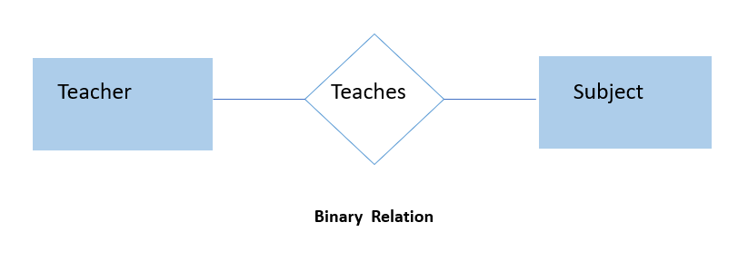
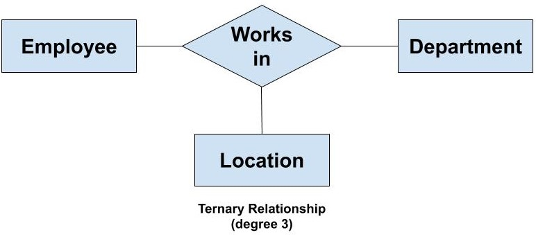
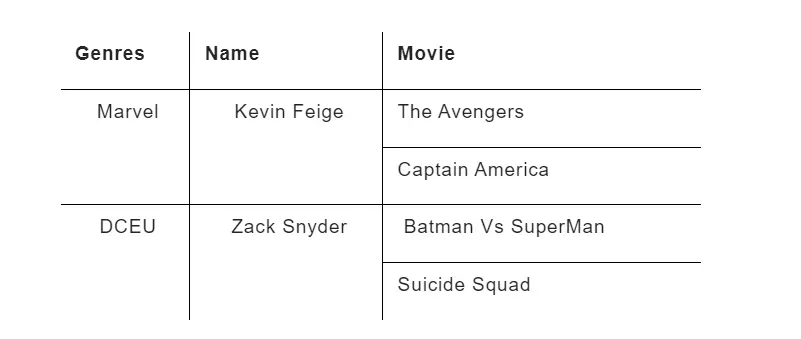
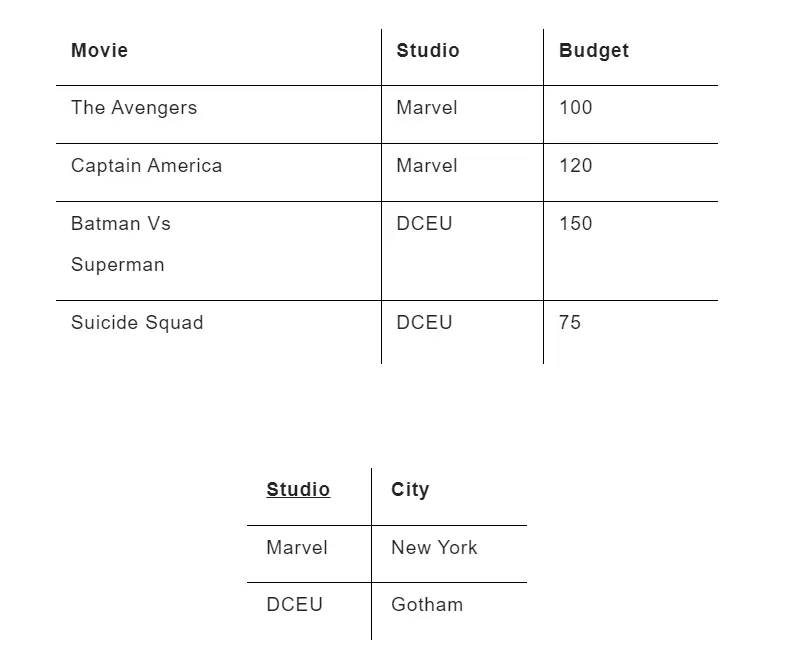

---

# DBMS

### Q1. What is DBMS used for? (TCS)
A Database Management System (DBMS) is an application system designed for managing data. It enables users to:
- Store data
- Define data
- Retrieve data
- Update data

### Q2. Why is the use of DBMS recommended? Explain by listing some of its major advantages. (WIPRo)
DBMS offers several advantages:
- **Controlled Redundancy**: Reduces data duplication.
- **Data Sharing**: Facilitates data access by multiple users.
- **Backup and Recovery Facility**: Ensures data protection and restoration.
- **Enforcement of Integrity Constraints**: Maintains data accuracy and consistency.
- **Independence of Data**: Separates data from application programs.

### Q3. What is Schema? (Amazon)
A **Schema** represents the structure of a database, typically through a diagram. It shows the relationships between tables but does not display the actual data in those tables.

### Q4. What is Instance? (Adobe)
An **Instance** of a database refers to the data present in the database at a specific moment. The database schema defines the structure, while the instance represents the actual data values at a given time.

### Q5. Explain the three layers of the 3-tier architecture.
The three layers are:
1. **Client Layer**: The user interface.
2. **Business Layer**: The application logic.
3. **Data Layer**: The database.

---

# ER MODEL

### What are ER Models?
An **Entity Relationship Diagram (ERD)** visually represents different data elements and their relationships. The E-R modeling technique is a top-down approach.

For example, the elements "writer," "novel," and "consumer" can be depicted using ER diagrams:

In the diagram:
- Entities are represented by rectangles.
- Relationships are depicted by diamonds.

### ER Diagram
ER-modeling is a technique used to create a conceptual data model of an information system. The diagrams produced are known as Entity-Relationship Diagrams (ERDs).

### Entity
An **Entity** is a distinguishable object with attributes. In a database, entities represent real-world objects or concepts.

**Example**: In a school database, entities might include students, teachers, classes, and courses.

### Types of Entity

1. **Strong Entities**: Exist independently of other entities.
   

2. **Weak Entities**: Depend on other entities for identification.
   

3. **Recursive Entities**: An entity where a relation exists between occurrences of the same entity set. For example, an employee who is also a manager.
   

4. **Composite Entities**: Used to resolve many-to-many relationships by creating a bridge entity. Represented by a diamond shape within a rectangle.
   

### Entity Sets
An **Entity Set** is a collection of similar entities. It can contain entities with attributes that share similar values. Entity sets do not need to be disjoint.

**Example**: A "Students" set may include all students in a school.

### Weak Entity
A **Weak Entity** relies on another entity for its identification. It uses a foreign key combined with its attributes to form a primary key.

**Example**: An order item depends on an order for its meaning.

### Attribute
**Attributes** represent the properties of entities. They have specific values and fall within a defined domain.

**Example**: A student entity might have attributes such as name, class, and age.

### Types of Attributes

1. **Simple Attributes**: Atomic values that cannot be divided further.
   

2. **Composite Attributes**: Attributes that can be divided into smaller sub-attributes. Represented by a tree-like structure.
   

3. **Derived Attributes**: Attributes whose values are derived from other attributes. They do not exist directly in the database.
   

4. **Multi-valued Attributes**: Attributes that can hold multiple values.
   

# Relationships

### One-to-One
In a one-to-one relationship, an entity from **Entity Set A** can be associated with at most one entity from **Entity Set B**, and vice versa.

### One-to-Many
In a one-to-many relationship, an entity from **Entity Set A** can be associated with multiple entities from **Entity Set B**. However, an entity from **Entity Set B** can be associated with at most one entity from **Entity Set A**.

### Many-to-One
In a many-to-one relationship, multiple entities from **Entity Set A** can be associated with at most one entity from **Entity Set B**. Conversely, an entity from **Entity Set B** can be associated with multiple entities from **Entity Set A**.

### Many-to-Many
In a many-to-many relationship, an entity from **Entity Set A** can be associated with multiple entities from **Entity Set B** and vice versa.
- A many to many relationships between two entities usually results in Three tables.

### Total and Partial Participation

- **Total Participation**: Each entity in the entity set must participate in at least one relationship within that relationship set. This is indicated by double lines drawn from the entity to the relationship.

- **Partial Participation**: Not all entities in the entity set need to participate in the relationship. This is shown by single lines drawn from the entity to the relationship.

# Creating an ER Diagram

### Entities
An **Entity** is an object or concept about which you want to store information.

- **Weak Entity**: A weak entity cannot be uniquely identified by its own attributes alone and must be defined by a foreign key relationship with another entity.

### Relationships
**Relationships** are represented by diamond shapes and show how two entities share information in the database.

### Attributes
**Attributes** are represented by ovals. A **key attribute** is a unique, distinguishing characteristic of the entity.

**Example**: An employee's social security number might be the key attribute for the employee.

- **Multivalued Attribute**: An attribute that can have more than one value.

**Example**: An employee entity can have multiple skill values.

### Generalization
**Generalization** is the process of combining multiple entities into one generalized entity based on shared characteristics.

**Example**: Pigeons, house sparrows, crows, and doves can all be generalized as "Birds."

### Specialization
**Specialization** is the opposite of generalization. It involves dividing a group of entities into subgroups based on specific characteristics.

**Example**: A person can be specialized into roles such as employee, employer, customer, or vendor, based on their role in a company. Similarly, in a school database, persons can be specialized into roles such as teacher, student, or staff.

### Aggregation
**Aggregation** refers to the process of combining entities to form a single meaningful entity. It represents a relationship between a whole object and its component parts. Aggregation is used to model relationships among relationships.

### Problems

1. **Hospital ER Diagram**: Construct an ER diagram for a hospital with a set of patients and a set of doctors. Associate each patient with a log of various tests and examinations conducted.

   

2. **Car Insurance Company ER Diagram**: Construct an ER diagram for a car-insurance company where customers own one or more cars. Each car may have zero or more recorded accidents.

   

Here's a polished version of the README for your interview questions:

---

# Interview Questions and Answers

### Q1. What is Cardinality? (Capgemini)

Cardinality refers to the nature of the relationships between entities in a database. It defines the number of instances of one entity that can or must be associated with instances of another entity. The primary types of cardinality are:

- **One-to-One:** A single record in one entity is related to a single record in another entity.
- **One-to-Many:** A single record in one entity can be related to multiple records in another entity.
- **Many-to-Many:** Multiple records in one entity can be related to multiple records in another entity.

In database terminology, **high cardinality** indicates a column with a large number of unique values, while **low cardinality** means fewer unique values.

---

### Q2. What Does ERD Stand For, and What Is It? (TCS)

**ERD** stands for **Entity Relationship Diagram**. It is a visual representation of entities and their relationships in a database. In an ERD:

- **Entities** are represented by rectangles or boxes.
- **Relationships** between entities are illustrated by lines or arrows connecting these boxes.

ERDs help in designing and understanding the structure of a database.

---

### Q3. What is an Entity? (Wipro)

An **entity** in a database context is a distinct object or concept that can be identified and stored. It represents a real-world object, person, place, or event. For detailed definitions of entities in specific operating systems, please refer to the notes under the heading "Entity."

---

### Q4. Explain a Real-Life Example of Generalization. (Amazon)

**Generalization** involves creating a higher-level entity from multiple lower-level entities. For instance:

- **Saving Account** and **Current Account** are specific types of accounts.
- They can be generalized into a single higher-level entity called **Account**, which encompasses both types.

---

### Q5. How Does Generalization Differ from Specialization? (TCS, Infosys)

- **Generalization** is a bottom-up approach where multiple lower-level entities are combined to form a higher-level entity. 
  - Example: Combining **Saving Account** and **Current Account** into **Account**.

- **Specialization** is a top-down approach where a higher-level entity is divided into lower-level entities.
  - Example: Breaking down **Account** into **Saving Account** and **Current Account**.

---

### Q6. How is the Degree Assigned to a Relationship? (Adobe)

The **degree** of a relationship in a database is determined by the number of entities involved in the relationship. It indicates how many entities participate in the relationship:

- **Binary Relationship:** Involves two entities.
- **Ternary Relationship:** Involves three entities.
- **N-ary Relationship:** Involves more than three entities.

---

### Q7. What is a Composite Entity? (Veritas)

A **composite entity** is an entity that is created to represent a many-to-many relationship between two other entities. It often includes foreign keys from both entities to form a composite key. For detailed definitions, please refer to the notes under the heading "Composite Entity."

---

### Q8. Explain Derived Attributes.

**Derived attributes** are attributes whose values are computed from other attributes rather than being stored directly. For instance, an employee's **age** can be derived from their **date of birth**. For more detailed definitions, please refer to the notes under the heading "Derived Attribute."

Here's a formatted version of your content:

---

### RDBMS

**RDBMS** stands for Relational Database Management System. 

Data in an RDBMS is structured in database tables, which consist of rows and columns. Each table row contains one or more fields (columns).

An RDBMS stores data in a collection of tables that may be related through common fields (columns). It also provides relational operators for manipulating the data within these tables.

---

### Degree of Relationship

The degree of relationship refers to the number of participating entities in a relationship. 

- **Binary Relationship**: Involves two entity sets. Most relationships in database systems are binary.
- **Ternary Relationship**: Involves three entity sets. Relationships with more than three entities are rare and become increasingly complex.

**Types of Degree**:
- **Unary**
- **Binary**
- **Ternary**

---

#### Unary Relationship

A relationship is unary when both participating entity types are the same. The degree of such a relationship is 1.

*Example*:  
A single entity type participating in the relationship. The minimum degree of a relationship is one.

---

#### Binary Relationship

A relationship is binary when two entities are involved. The degree of this relationship is 2. Binary relationships can be easily converted into relational tables.

*Example*:  
The relationship "a Teacher teaches one or more Subjects" represents a binary relationship.

---

#### Ternary Relationship

A relationship involving three entities is called a ternary relationship. The degree of this relationship is 3. As the number of entities in the relationship increases, it becomes more complex to represent them in relational tables.

*Example*:  
The relationship between 'Employee', 'Department', and 'Location'. Here, an employee works in a department and at a specific location. Since three entities are involved, the degree of this relationship is 3.

---

### Database Schema

The term **database schema** can refer to:
1. A visual representation of a database.
2. A set of rules governing the database.
3. The entire set of objects belonging to a particular user.

It includes attributes and instructions that define how data is organized and how elements are related.

**Database Schema Types**:
- **Logical Schema**
- **Physical Schema**
- **View Schema**

---

#### Logical Schema

Represents how data is organized in tables and how attributes are linked together. Different schemas use various syntaxes to define logical architecture and constraints.

---

#### Physical Schema

Represents how data is physically stored on disk storage. This includes the actual code used to create the database structure. For example:
- In MongoDB with Mongoose, this is a Mongoose model.
- In MySQL, SQL is used to construct tables.

---

#### View Schema

Describes the view level design of the database, focusing on end-user interaction with the database system.

---

### Interview Questions and Answers

#### **Q1. Give a quick idea of the term RDBMS?** (Adobe)

**Answer**: An RDBMS (Relational Database Management System) helps in storing and managing data across multiple tables. It allows you to define relationships among different data entries using these tables. The relationships are expressed through values rather than pointers.

---

#### **Q2. How will you define a relational database model?** (Accenture)

**Answer**: A relational database model defines the relationships among various databases and how they are interconnected. When multiple databases are linked, it creates flexibility and can be utilized within software applications as needed.

---

#### **Q3. What are the components of RDBMS?** (Vmware)

**Answer**: The key components of an RDBMS include:
- **Name**: A unique identifier for each relation (table).
- **Attributes**: Columns in the table representing data fields.
- **Tuples**: Rows in the table, each representing a single record.

**Structure**:  
- **Name → Attributes → Tuples**

---

#### **Q4. What is an E-R Model?** (Infosys)

**Answer**: An E-R (Entity-Relationship) Model consists of entities and relational objects. Entities are represented by collections of attributes within the database, defining the data structure and relationships.

---

#### **Q5. Tell me something about various data abstraction levels?** (Goldman Sachs)

**Answer**: In RDBMS, data abstraction occurs at three different levels:
- **Physical Level**: Details data storage on disk.
- **Logical Level**: Defines the organization and relationship of data tables.
- **View Level**: Provides various perspectives and views of the database for user interaction.

**Levels**:
- Physical Level → Logical Level → View Levels (View 1, View 2, View 3)

---

#### **Q6. How are RDBMS preferable options over the DBMS?** (Amazon)

**Answer**: RDBMSs are preferable over DBMSs because they:
- Minimize redundancy and maintain data integrity.
- Ensure data consistency and support data sharing across different databases.
- Follow a set of rules for storage standards and security.

---

#### **Q7. What are the two specific rules that you should follow for each RDBMS to maintain data integrity?** (Flipkart)

**Answer**: 
1. **Entity Integrity**: The Primary Key must never contain NULL values.
2. **Referential Integrity**: A Foreign Key must refer to a Primary Key in another table.

---

#### **Q8. Does RDBMS follow an object-oriented approach or not?** (Amazon)

**Answer**: RDBMSs do not inherently follow an object-oriented approach. While object-oriented databases are based on objects and classes, RDBMSs are based on tables and relationships. The object-oriented model involves objects and classes with shared properties, which differs from the relational model's focus on table-based data structures.

---

#### **Q9. What are the different features of an RDBMS?** (Oracle)

**Answer**: Key features of an RDBMS include:
- **Name**: Each relation (table) must have a unique name.
- **Attributes**: Columns in a table are called attributes.
- **Tuples**: Rows in a table are called tuples, representing individual records.

**Additional Feature**:
- **Entity Integrity Constraint**: The primary key value cannot be NULL, as it is essential for identifying individual rows in a table. However, other columns can contain NULL values.

---

### Interview Questions and Answers

#### **Q1. Give a quick idea of the term RDBMS?** (Adobe)

**Answer**: An RDBMS (Relational Database Management System) is designed to store and manage data across multiple tables. It allows the definition of relationships among different data entries through these tables. These relationships are typically expressed using values rather than pointers.

---

#### **Q2. How will you define a relational database model?** (Accenture)

**Answer**: A relational database model defines the relationships among different databases and how they are interconnected. By connecting multiple databases, it offers flexibility and can be leveraged within software applications as required.

---

#### **Q3. What are the components of RDBMS?** (Vmware)

**Answer**: The primary components of an RDBMS include:
- **Name**: A unique identifier for each relation (table).
- **Attributes**: Columns in the table, representing data fields.
- **Tuples**: Rows in the table, each representing a single record.

**Structure**:  
**Name → Attributes → Tuples**

---

#### **Q4. What is an E-R Model?** (Infosys)

**Answer**: An Entity-Relationship (E-R) Model consists of entities and their relationships. Entities are represented by collections of attributes, defining the structure of the database and how different entities relate to each other.

---

#### **Q5. Tell me something about various data abstraction levels?** (Goldman Sachs)

**Answer**: In RDBMS, data abstraction is organized into three levels:
- **Physical Level**: Details the storage of data on disk.
- **Logical Level**: Defines the structure and relationships of data tables.
- **View Level**: Provides various perspectives and views of the database for user interaction.

**Abstraction Levels**:  
**Physical Level → Logical Level → View Levels (View 1, View 2, View 3)**

---

#### **Q6. How are RDBMS preferable options over the DBMS?** (Amazon)

**Answer**: RDBMSs are preferable to traditional DBMSs because they:
- Minimize redundancy and maintain data integrity.
- Ensure data consistency and support data sharing across databases.
- Follow strict rules for data storage standards and security.

---

#### **Q7. What are the two specific rules that you should follow for each RDBMS to maintain data integrity?** (Flipkart)

**Answer**: To maintain data integrity in an RDBMS:
1. **Entity Integrity**: The Primary Key must never contain NULL values.
2. **Referential Integrity**: Foreign Keys must refer to Primary Keys in other tables.

---

#### **Q8. Does RDBMS follow an object-oriented approach or not?** (Amazon)

**Answer**: No, RDBMS does not inherently follow an object-oriented approach. While object-oriented databases focus on objects and classes, RDBMSs use tables and relationships. The object-oriented model involves objects with attributes and methods, which is different from the table-based structure of an RDBMS.

---

#### **Q9. What are the different features of an RDBMS?** (Oracle)

**Answer**: Key features of an RDBMS include:
- **Name**: Each table (relation) must have a unique name.
- **Attributes**: Columns in the table are called attributes.
- **Tuples**: Rows in the table are called tuples, each representing a record.

**Additional Feature**:
- **Entity Integrity Constraint**: The primary key value cannot be NULL to ensure unique identification of rows. Other columns in the table may contain NULL values.

---

### Normalization

**Normalization** is a process used to organize data in a database to reduce redundancy and improve data integrity. The main goals of normalization are to eliminate anomalies and ensure that the database structure is logically sound and efficient.

---

#### **What is Normalization?**

Normalization involves structuring data into tables in such a way that:
- **Data Redundancy**: Avoids duplication of data.
- **Insertion Anomaly**: Prevents issues when inserting new data.
- **Update Anomaly**: Prevents inconsistencies when updating data.
- **Deletion Anomaly**: Prevents unintentional loss of data when deleting records.

Normalization is a core principle of relational database theory and may lead to the creation of additional tables, which can sometimes result in data duplication. However, this structure ensures that database results are clear and as intended.

---

#### **Advantages of Normalization**

1. **Elimination of Data Redundancy**: 
   - Reduces the overall space consumed by the database, making it more compact.

2. **Enforcement of Referential Integrity**: 
   - Ensures consistency of data across all tables.

3. **Easier Maintenance**: 
   - Simplifies the management of data due to its logical and organized structure.

4. **Improved Searching and Sorting**: 
   - Facilitates quicker search and sort operations by having data in smaller, more manageable tables.

---

#### **Difference Between Normalization and Denormalization**

Normalization and denormalization are contrasting processes:

- **Normalization**:
  - **Purpose**: To reduce redundancy by dividing large tables into smaller, more manageable ones.
  - **Goal**: Prevent database anomalies and ensure a logical structure.
  - **Effect**: May result in multiple tables and potential data duplication.

- **Denormalization**:
  - **Purpose**: To improve performance by adding redundant data to optimize read operations.
  - **Goal**: Enhance read performance, often at the cost of increased complexity for write operations.
  - **Effect**: Can result in slower write operations (insert, update, delete) due to additional constraints.

**Best Practice**: "Normalize until it hurts, denormalize until it works." This means you should aim for normalization to eliminate redundancy and anomalies but consider denormalization when it benefits performance without compromising data integrity.

---

**Summary**: Normalization is crucial for maintaining a clean and efficient database structure, while denormalization can be employed strategically to improve performance for specific use cases.

### Types of Normalization

Normalization involves organizing a database to minimize redundancy and improve data integrity. There are several levels or normal forms of normalization, each addressing different types of anomalies.

---

#### **1st Normal Form (1NF)**

**Definition**: 
A table is in the First Normal Form (1NF) if:
- All columns contain atomic (indivisible) values.
- Each table has a primary key that uniquely identifies each record.
- There are no repeating groups or arrays within the table.

**Example of a Table Not in 1NF**:

**Transformation to 1NF**:
To achieve 1NF, decompose the table into atomic elements so that each column contains only a single value.

**Table in 1NF After Normalization**:

---

#### **2nd Normal Form (2NF)**

**Definition**: 
A table is in the Second Normal Form (2NF) if:
- It is in 1NF.
- No non-prime attribute is dependent on a proper subset of any candidate key.

**Definitions**:
- **Prime Attribute**: An attribute that is part of a candidate key.
- **Non-prime Attribute**: An attribute that is not part of any candidate key.

**Example of a Table Not in 2NF**:

In this example, the primary key is a composite key (studio, movie), but the `city` attribute is dependent only on `studio` and not on the entire key.

**Solution for 2NF**:
- **Old Scheme**: {Studio, Movie, Budget, City}
- **New Schemes**:
  - {Movie, Studio, Budget}
  - {Studio, City}

**Tables in 2NF After Normalization**:

---

#### **3rd Normal Form (3NF)**

**Definition**:
A table is in the Third Normal Form (3NF) if:
- It is in 2NF.
- No attribute is transitively dependent on the primary key.

**Definition**:
- **Transitive Dependency**: A condition where a non-key attribute depends on another non-key attribute, which in turn depends on the primary key.

**Example of a Table Not in 3NF**:

Here, `Studio` is the primary key, but `CityTemp` is transitively dependent on `Studio` through `StudioCity`.

**Solution for 3NF**:
- **Old Scheme**: {Studio, StudioCity, CityTemp}
- **New Schemes**:
  - {Studio, StudioCity}
  - {StudioCity, CityTemp}

**Tables in 3NF After Normalization**:

---

#### **Boyce-Codd Normal Form (BCNF) – 3.5NF**

**Definition**:
A table is in Boyce-Codd Normal Form (BCNF) if:
- It is in 3NF.
- Every determinant is a candidate key. This means there are no dependencies between attributes that are not candidate keys.

**Example of a Table Not in BCNF**:
- **Scheme**: {MovieTitle, MovieID, PersonName, Role, Payment}
- **Candidate Keys**: {MovieTitle, PersonName} and {MovieID, PersonName}

**Dependency Issue**: The dependency between `MovieID` and `MovieTitle` violates BCNF because neither is a candidate key in the context of the other attributes.

**Solution for BCNF**:
- **New Schemes**:
  - {MovieID, PersonName, Role, Payment}
  - {MovieID, MovieTitle}

**Tables in BCNF After Normalization**:

---

#### **4th Normal Form (4NF)**

**Definition**:
A table is in Fourth Normal Form (4NF) if:
- It is in BCNF.
- It has no multi-valued dependencies other than a candidate key. This means that a table should not have more than one multi-valued dependency.

**Example of a Table Not in 4NF**:
- **Scheme**: {MovieName, ScreeningCity, Genre}

**Issue**: The table violates 4NF because `MovieName` can have multiple `ScreeningCity` values and multiple `Genre` values.

**Solution for 4NF**:
- **New Schemes**:
  - {MovieName, ScreeningCity}
  - {MovieName, Genre}

**Tables in 4NF After Normalization**:

---

Normalization helps in structuring a database to be efficient and consistent, reducing redundancy and anomalies. Each normal form builds upon the previous ones, addressing different aspects of database design.